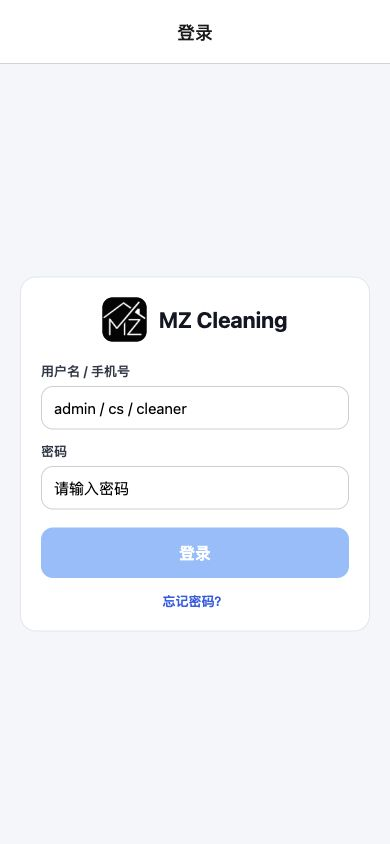
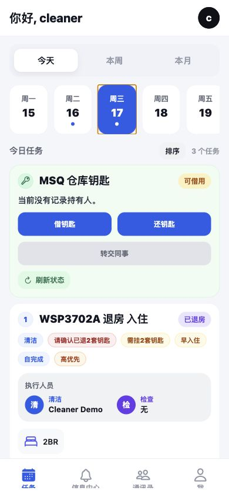
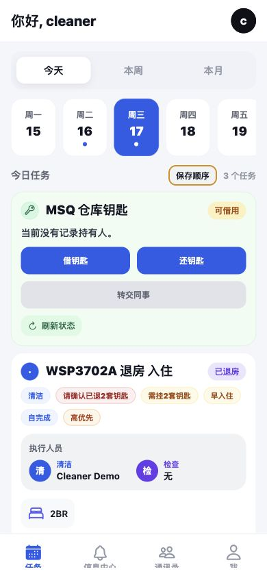
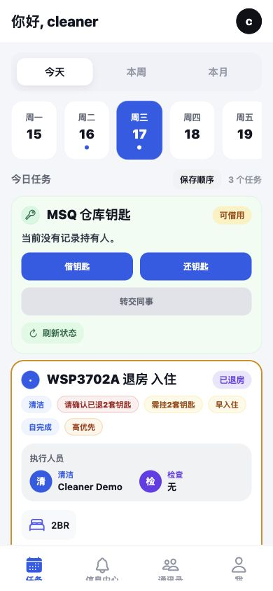
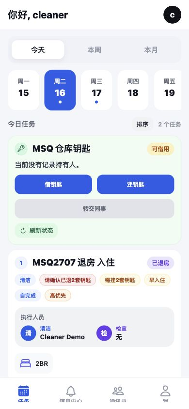
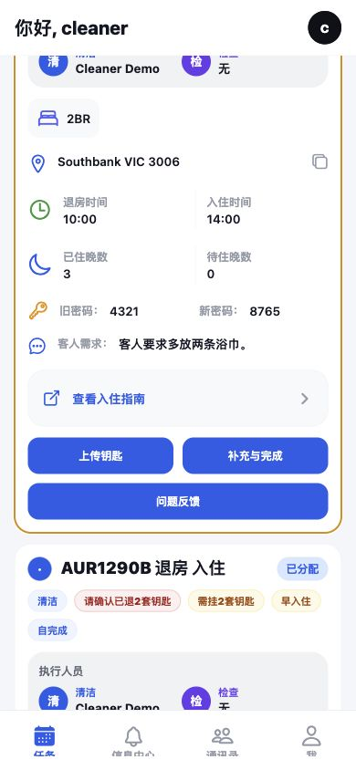
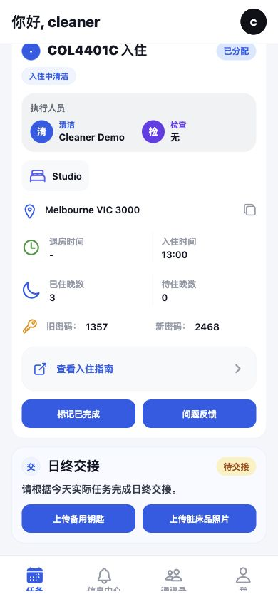

# MZStay Mobile Cleaner 操作指南

适用角色：清洁员 Cleaner
适用端：MZStay 移动端 App
截图说明：以下截图来自当前 App 界面，使用本地演示数据生成。正式使用时以 App 中实际房号、时间、密码、备注为准。

## 1. 登录 App

打开 App 后进入登录页，输入公司分配的账号和密码。

操作步骤：

1. 在“用户名 / 手机号”输入自己的账号。
2. 在“密码”输入自己的密码。
3. 点击“登录”。
4. 如果系统询问是否记住密码，按公司要求选择；公共设备不要记住密码。

## 2. 前一天晚上先排序第二天任务

每天晚上先打开第二天的任务，把第二天要做的房源按路线顺序排好。第二天上班时直接按排序执行，避免来回跑、漏房或先后顺序混乱。

先在任务页顶部选择明天的日期。截图中当前日期是周二 16，明天是周三 17。

操作步骤：

1. 打开底部“任务”页。
2. 在顶部日期栏点选明天日期。
3. 检查明天任务数量是否正确。
4. 先看房号、区域、退房时间、入住时间、早入住/晚退房/高优先级标签。
5. 决定实际执行路线：通常优先处理早入住、高优先、距离近的一组房源。

点击右侧“排序”，进入排序模式。进入后按钮会变成“保存顺序”，任务左侧会显示排序圆点。

操作步骤：

1. 点击“排序”。
2. 按明天实际执行路线，依次点选任务卡片。
3. 被选中的任务会高亮，用来确认正在排序的任务。
4. 所有要排序的任务都点完后，点击“保存顺序”。

保存后回到任务列表，左侧数字就是执行顺序。第二天按数字从 1 开始做。

注意事项：

1. 前一天晚上排序时，只排自己负责的清洁任务。
2. 如果第二天早上客服临时加房、改时间或换人，需要重新打开对应日期检查并重新保存顺序。
3. 早入住、高优先、晚退房、需要两套钥匙的房源，要优先确认。
4. 不确定路线时，先不要乱排，联系负责人确认后再保存。

## 3. 当天查看任务

当天进入任务页后，默认看到今日任务。每张任务卡会显示房号、状态、执行人员、房型、地址、退房/入住时间、旧密码、新密码、客人需求或备注。

操作步骤：

1. 先确认顶部日期是今天。
2. 按左侧顺序数字执行任务。
3. 每个任务开始前检查退房状态、入住时间和特殊备注。
4. 如看到“需挂2套钥匙”，完成后要按要求处理两套钥匙。
5. 密码只以 App 页面显示为准，不要在聊天软件里转发或截图外传。

## 4. 单个任务内常用操作

任务卡下方会显示常用按钮，包括“上传钥匙”“补充与完成”“标记已完成”“问题反馈”。

常用操作：

1. 上传钥匙：清洁完成并挂好钥匙后上传钥匙照片。
2. 补充与完成：填写补品、消耗品、清洁完成信息。
3. 标记已完成：入住中清洁等简单任务可直接标记完成。
4. 问题反馈：发现维修、缺货、损坏、客人遗留物等情况时提交反馈。

## 5. 清洁完成后的检查

每个房源完成前至少确认：

1. 房间、厨房、浴室、阳台已清洁。
2. 床品、毛巾、补品按要求补齐。
3. 垃圾已清走。
4. 门窗、空调、电器、水龙头状态正常。
5. 钥匙按 App 要求挂回或交接。
6. App 中对应任务已完成必要上传或标记。

## 6. 日终交接

当天所有任务处理完后，在任务页底部找到“日终交接”。清洁员需要根据当天实际情况上传备用钥匙、脏床品照片等交接材料。

操作步骤：

1. 滚动到任务页底部。
2. 找到“日终交接”卡片。
3. 点击“上传备用钥匙”，按要求拍照或上传。
4. 点击“上传脏床品照片”，按要求拍照或上传。
5. 如果当天有 Reject 床品或仓库钥匙相关要求，按页面提示补齐。
6. 确认资料齐全后再提交。

## 7. 出现问题时怎么处理

遇到以下情况，不要只在线下沟通，要在 App 里留下记录：

1. 房间有维修问题。
2. 客人遗留物品。
3. 房间严重脏乱，正常时间无法完成。
4. 钥匙缺失、钥匙数量不对、门锁密码异常。
5. 补品不足或仓库缺货。
6. 房源地址、房号、入住时间与实际情况不一致。

处理步骤：

1. 在对应任务卡点击“问题反馈”。
2. 选择问题类型。
3. 写清楚房号、位置、情况。
4. 上传现场照片。
5. 提交后通知负责人查看。

## 8. 每天操作顺序建议

1. 前一天晚上：打开明天日期，检查任务并排序。
2. 当天开始前：打开今日任务，确认排序、特殊标签和钥匙要求。
3. 做每个房源前：查看地址、时间、密码和备注。
4. 做完每个房源后：上传钥匙、补充与完成、问题反馈。
5. 全部任务结束后：完成日终交接。

## 9. 完成标准

一天结束前，清洁员应确认：

1. 今日所有负责房源都已处理。
2. 每个任务状态已在 App 中更新。
3. 需要的钥匙照片、补品信息、问题反馈已提交。
4. 日终交接已完成。
5. 第二天任务已提前排序。
